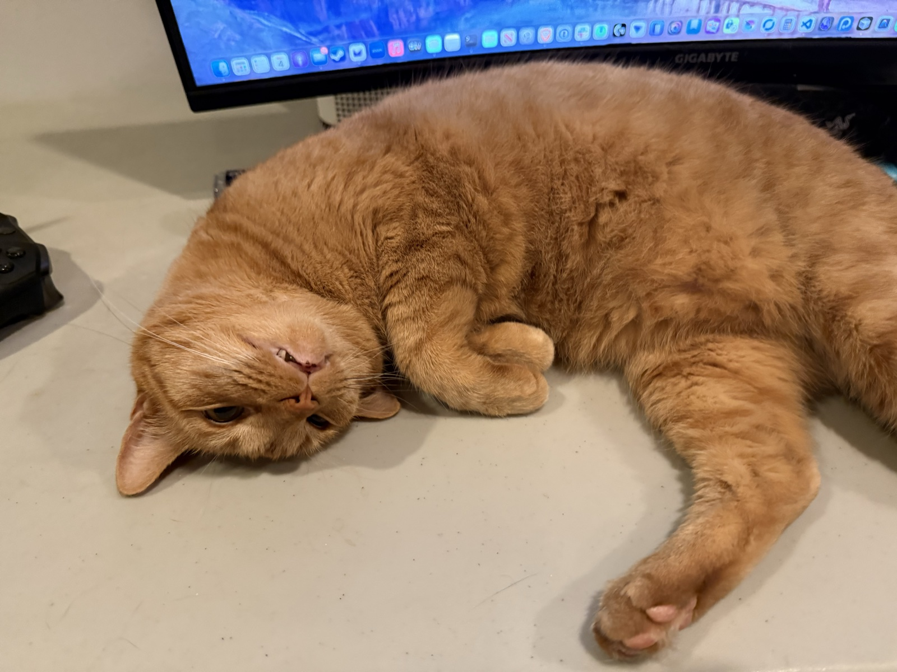
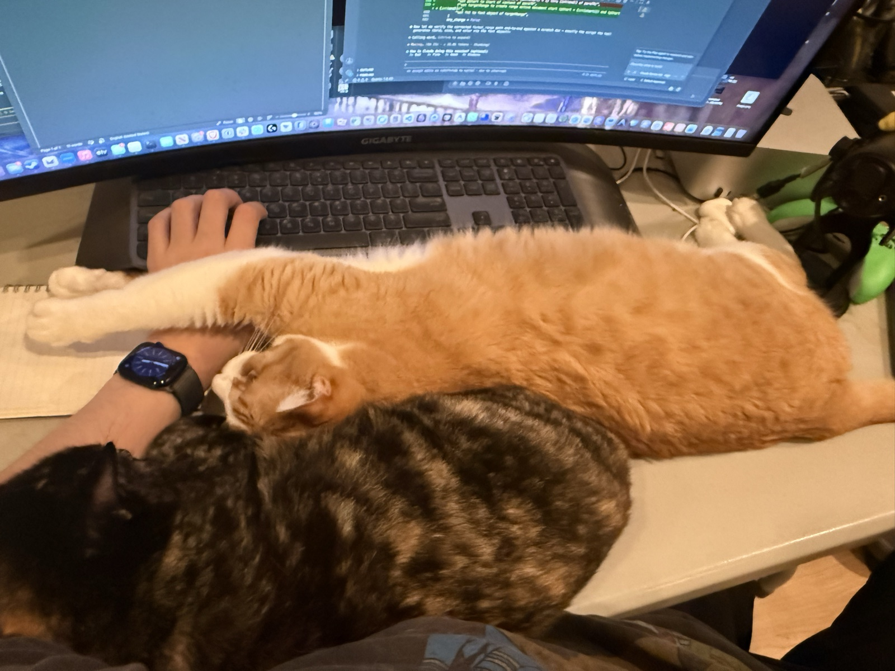
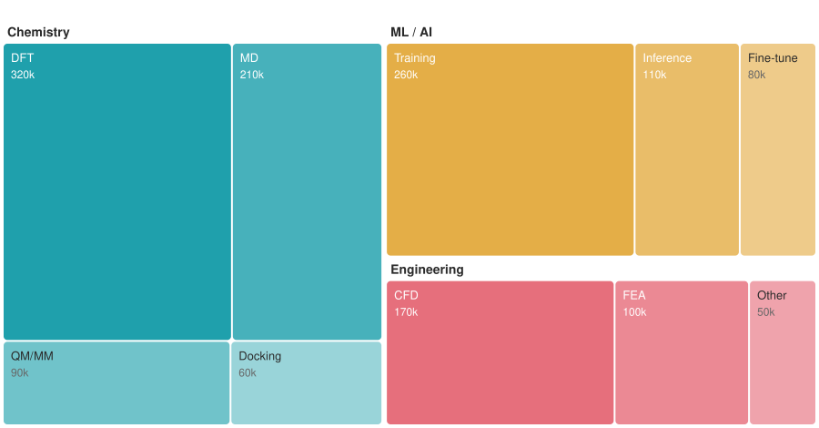
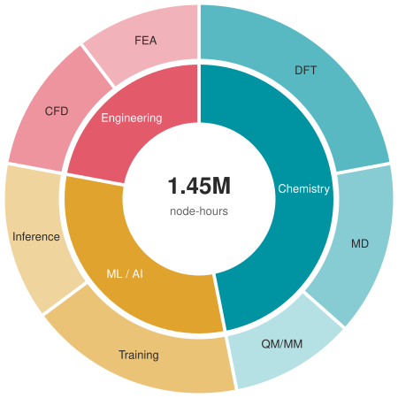
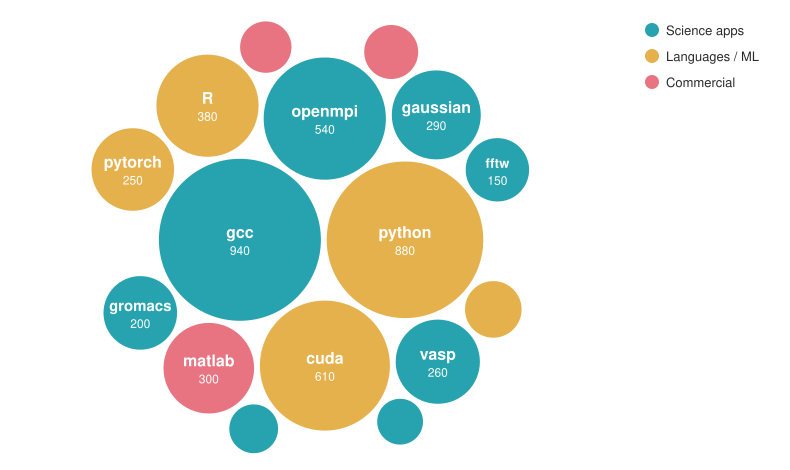
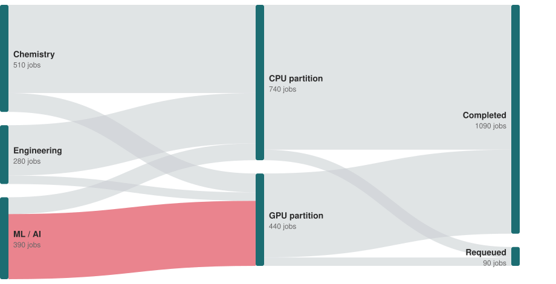
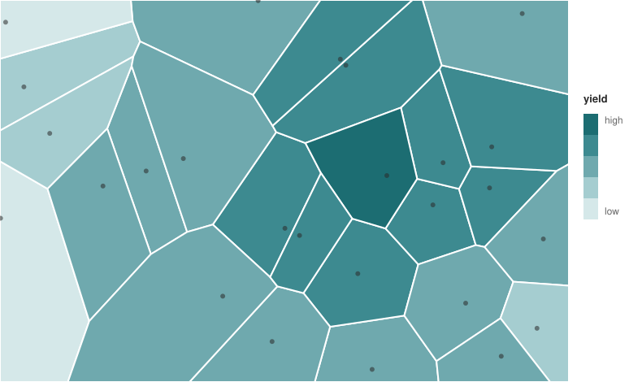

<!-- ═══════════════════════════════════════════════════════════════════════════
     STRUCTURE — keep and fill in for every talk
     ═══════════════════════════════════════════════════════════════════════════ -->

# Overview {visibility="hidden"}

## Overview

::: {.text-md}
:::: {.columns}
::: {.column width="60%"}

Brief intro paragraph. What will attendees learn or do?

**Topics covered:**

- Topic one
- Topic two
- Topic three
- Topic four

:::
::: {.column width="40%"}
::: {.callout-note appearance="simple"}
### Note
An optional note, tip, or heads-up for your audience.
:::
:::
::::
:::

## Resources & Materials

::: {.text-md}
:::: {.columns}
::: {.column width="60%"}

**Slides & materials**

- GitHub: [github.com/YOUR-ORG/REPO](https://github.com)
- HTML: [your-org.github.io/REPO](https://github.com)

**Software / prerequisites**

- Requirement one
- Requirement two

**Contact:** [your@email.edu](mailto:your@email.edu)

:::
::: {.column width="40%"}
::: {.center-content}


::: {.text-sm}
Point your phone here
:::
:::
:::
::::
:::

## Follow Along {.slide-flow}

::: {.text-md}
:::: {.columns}
::: {.column width="62%"}

Set up now — flag a helper if any step fails:

::: {.steps}
1. **Log in** — `ssh you@cluster.university.edu`
2. **Get materials** — `git clone https://github.com/YOUR-ORG/REPO`
3. **Environment** — `module load python/3.11`
4. **Check** — `python check_setup.py` prints `ready`
:::

:::
::: {.column width="38%"}

::: {.center-content}


[github.com/YOUR-ORG/REPO](https://github.com)
:::

::: {.text-sm}
Regenerate the QR for your repo:
`npx qrcode -t svg -d '#1C6D72' -o assets/qr-materials.svg '<url>'`
:::

:::
::::
:::

<!-- ═══════════════════════════════════════════════════════════════════════════
     CONTENT PATTERNS
     Delete what you don't need. Add section breaks as needed.
     ═══════════════════════════════════════════════════════════════════════════ -->

# Section One {background-color="#1C6D72"}

## Two-Column 60/40 (default)

::: {.text-md}
:::: {.columns}
::: {.column width="60%"}

Main explanation or content. This column has more space for prose, bullets, or a snippet.

- Key point one
- Key point two
- Key point three

:::
::: {.column width="40%"}
::: {.callout-tip appearance="simple"}
### Best Practice
Use the narrower column for a callout, image, or summary box — avoid full-width bullet dumps.
:::
:::
::::
:::

## Two-Column 50/50

::: {.text-md}
:::: {.columns}
::: {.column width="50%"}

**Left column heading**

- Point one
- Point two
- Point three

:::
::: {.column width="50%"}

**Right column heading**

- Point A
- Point B
- Point C

:::
::::
:::

## Three-Column 33/33/33

::: {.text-sm}

A spectrum or three-way comparison. Use `.text-sm` by default — three columns
get cramped at `.text-md`. Highlight-boxes label each column.

:::: {.columns}
::: {.column width="33%"}

::: {.highlight-box}
**Option / Tier / Phase 1**
:::

*"One-line tagline."*

- Point one
- Point two
- Point three

*Cost or signal line.*

:::
::: {.column width="33%"}

::: {.highlight-box}
**Option / Tier / Phase 2**
:::

*"One-line tagline."*

- Point one
- Point two
- Point three

*Cost or signal line.*

:::
::: {.column width="33%"}

::: {.highlight-box}
**Option / Tier / Phase 3**
:::

*"One-line tagline."*

- Point one
- Point two
- Point three

*Cost or signal line.*

:::
::::

:::

## Comparison (A vs B)

::: {.text-md}
:::: {.columns}
::: {.column width="50%"}

::: {.highlight-box}
**Option A — Recommended**
:::

- Advantage one
- Advantage two
- Advantage three

:::
::: {.column width="50%"}

::: {.accent-box}
**Option B — Avoid / Legacy**
:::

- Drawback one
- Drawback two
- Drawback three

:::
::::
:::

## Stacked Comparisons (multiple A-vs-B examples)

::: {.text-sm}

Two or more A-vs-B rows on one slide — useful when you want to show *several*
examples of the same contrast (e.g. "generic answer" vs. "domain-aware answer"
across a couple of error types).

**Example 1 — first error / question / scenario**

:::: {.columns}
::: {.column width="50%"}

::: {.accent-box}
**Wrong / Generic:** *one-line answer.*
:::

Why it fails in this context.

:::
::: {.column width="50%"}

::: {.highlight-box}
**Right / Domain-aware:** what the correct response actually does.
:::

:::
::::

**Example 2 — second error / question / scenario**

:::: {.columns}
::: {.column width="50%"}

::: {.accent-box}
**Wrong / Generic:** *one-line answer.*
:::

Why it fails in this context.

:::
::: {.column width="50%"}

::: {.highlight-box}
**Right / Domain-aware:** what the correct response actually does.
:::

:::
::::

:::

::: {.callout-important appearance="simple"}
### The point
A closing line that names the pattern across both examples.
:::

## Numbered Steps {.slide-flow}

::: {.text-md}
:::: {.columns}
::: {.column width="60%"}

::: {.steps}
1. First step — brief description of what this involves
2. Second step — brief description of what this involves
3. Third step — brief description of what this involves
4. Fourth step — brief description of what this involves
:::

:::
::: {.column width="40%"}
::: {.callout-warning appearance="simple"}
### Before you start
Any prerequisites or gotchas the audience should know.
:::
:::
::::
:::

## Step-by-Step Process {.slide-flow}

::: {.text-md}
:::: {.columns}
::: {.column width="60%"}

**Step 1 — Do the first thing**

Brief description of what this step involves.

**Step 2 — Do the second thing**

Brief description of what this step involves.

**Step 3 — Do the third thing**

Brief description of what this step involves.

:::
::: {.column width="40%"}
::: {.callout-warning appearance="simple"}
### Before you start
List any prerequisites or gotchas the audience should know.
:::
:::
::::
:::

## Hands-On: Submit a Job {.slide-code}

::: {.text-md}
`.exercise` marks the do-it-now block; the `{}` timer starts
on click and shifts amber, then red, as time runs out:
:::

::: {.exercise}
**Submit your first array job** (~5 min)

1. Copy the template: `cp /shared/ws/array.slurm .`
2. Set `--array=1-10` and your email
3. `sbatch array.slurm`, then watch it with `squeue -u $USER`

Goal: ten tasks visible in the queue.
:::



## Image + Caption

::: {.text-md}
:::: {.columns}
::: {.column width="60%"}

::: {.center-content}
<!--  -->
*Placeholder: replace with your diagram or screenshot*
:::

::: {.text-xs}
*Caption: describe what the image shows and why it matters.*
:::

:::
::: {.column width="40%"}

**What you're looking at:**

- Key observation one
- Key observation two
- Key observation three

::: {.callout-note appearance="simple"}
### Source
Attribution if needed.
:::

:::
::::
:::

## Image — constrained for screenshots

::: {.text-md}

`width="90%"` only constrains width. Tall portrait screenshots (terminals,
chat UIs, anything mobile-shaped) blow past the slide bottom and overlap
the footer. Use the inline style below to cap *both* dimensions:

```

```

The image scales down to whichever dimension hits its limit first, preserving
aspect ratio. Tune `max-height` to leave room for any caption/bullets in the
same column (~540px works for full-column images; ~580px if you drop the caption).
`border-radius: 6px` softens screenshot corners — keep it for UI/terminal grabs,
drop it for logos or diagrams where square corners read cleaner.

::: {.callout-tip appearance="simple"}
### Why inline style here
The "no inline `style`" rule applies to font-size (which compounds across
nested wrappers). Image dimensions don't compound, so inline `style` for
`max-height` is fine — and avoids adding a single-purpose CSS class.
:::
:::

## Big Screenshot + Bullets (demo slide)

::: {.text-sm}
:::: {.columns}
::: {.column width="55%"}

::: {.center-content}
<!--  -->
*Placeholder: a real screenshot of the thing in use*
:::

:::
::: {.column width="45%"}

**One-line framing of what's on screen.**

- What the user did
- What the system did in response
- The non-obvious detail to call attention to (file uploaded? real result returned? specific value visible?)

::: {.callout-tip appearance="simple"}
### Why this slide
One real screenshot beats four placeholder boxes. Walk the audience through
the screenshot verbally; let the bullets carry the framing.
:::

:::
::::
:::

## Slide with Paper / URL Footer

::: {.text-md}
:::: {.columns}
::: {.column width="60%"}

Add a `::: footer` div anywhere inside the slide to override the default footer with a citation or URL.

```
## My Slide

Content here.

::: footer
Author et al. (2024). *Title*. Journal.
[doi:10.1234/example](https://doi.org/10.1234/example)
:::
```

- Markdown links and italics render in the footer
- Applies only to that one slide — other slides keep the default
- Use `.text-xs` inside if the citation is long

:::
::: {.column width="40%"}
::: {.callout-tip appearance="simple"}
### When to use
Any slide that adapts or reproduces a figure, table, or result from a published source. Keeps attribution visible without cluttering the slide body.
:::
:::
::::
:::

::: footer
Smith et al. (2024). *A Great Paper*. Nature. [doi:10.1234/example](https://doi.org/10.1234/example)
:::

## Pull Quote

::: {.text-md}
:::: {.columns}
::: {.column width="65%"}

::: {.pull-quote}
"A finding or statement you want to highlight — from a paper, a collaborator, or your own work. Works best as a single punchy sentence."

— Author et al. (2024), *Journal Name*
:::

Supporting context or your response to the quote.

:::
::: {.column width="35%"}
::: {.callout-tip appearance="simple"}
### When to use
Citing a key paper, framing the problem with someone else's words, or landing a memorable result. Keep it to one sentence.
:::
:::
::::
:::

## Incremental Reveal

Use `. . .` to pause between bullet groups:

- First point — visible immediately

. . .

- Second point — appears on click

. . .

- Third point — appears on click

::: {.callout-tip appearance="simple"}
### When to use
Good for demos or walk-throughs where revealing all bullets at once would give away the answer.
:::

## Animated Emphasis (rough notation)

::: {.text-md}
Wrap a phrase in `[...]{.rn-fragment}` and a hand-drawn annotation sweeps over
it on click — each one is a normal fragment step. Advance to draw these:
:::

- The default is a [highlighter sweep]{.rn-fragment} — no options needed
- Circle the [one number that matters]{.rn-fragment rn-type=circle rn-color="#E35B6A"}
- Underline a [key term]{.rn-fragment rn-type=underline rn-color="#1C6D72"}
- Strike through the [old way of doing it]{.rn-fragment rn-type=strike-through rn-color="#E35B6A"}

::: {.callout-tip appearance="simple"}
### When to use
Landing one phrase mid-sentence without reaching for bold or a box. Types:
`highlight`, `circle`, `underline`, `box`, `strike-through`, `bracket`.
Stick to brand colors: teal `#1C6D72`, accent `#E35B6A`, default yellow.
:::

## Swap in Place (r-stack)

::: {.text-md}
Toggle two (or more) things in the *same spot* on click — A fades out as B
fades in. Good for before/after, vendor-A-vs-vendor-B, or layering a diagram.
Works with images, cards, or code blocks (here, two cards):
:::

::: {.r-stack}
::: {.fragment .fade-out fragment-index=0}
::: {.highlight-box}
**Option A** — shown first. Click to swap it out.
:::
:::
::: {.fragment .fade-in-then-out fragment-index=0}
::: {.accent-box}
**Option B** — replaces A in place on the first click.
:::
:::
:::

::: {.notes}
Speaker notes live in `::: {.notes}` — visible in presenter view (press `s`),
hidden on the slide and in PDF. Use them for what to *say*, not what to show.
:::

## Screenshot Carousel (r-stack)

::: {.text-md}
Page through N screenshots in one frame: `.fade-in-then-out` fragments with
successive `fragment-index`, last one plain `.fade-in` so it stays.
`.img-frame` replaces the per-image inline styling (variants: `.short`,
default, `.tall`):
:::

::: {.r-stack}
::: {.fragment .fade-out fragment-index=0}

:::
::: {.fragment .fade-in-then-out fragment-index=0}

:::
::: {.fragment .fade-in fragment-index=1}

:::
:::

::: {.text-sm}
Stand-ins for app screenshots. PDF export prints only the first image, so
keep carousels optional to the point.
:::

## Walkthrough: Geometry {auto-animate=true .slide-chem}


::: {.text-md}
:::: {.columns}
::: {.column width="76%"}
`.context-pin` keeps the system under discussion pinned top-right at fixed
coordinates — no hand-copied `.absolute` values — while the content below
changes. Keep pin-slide content in a ~75% column so it clears the pin.
(Hedgehog standing in for your molecule.)

- Bond lengths: r(An–O1) shortens 2.42 → 2.31 Å across the series
- Angle O1–An–O2 stays linear within 2°
:::
::::
:::

## Walkthrough: Charges {auto-animate=true .slide-chem}


::: {.text-md}
:::: {.columns}
::: {.column width="76%"}
Second slide of the pair — same pin, new content, `{auto-animate=true}` on
both so the pin holds perfectly still. The audience never loses which system
the numbers belong to.

- NBO partial charge on the metal drops 1.8 → 1.4 e
- Ligand donation tracks the bond-length trend
:::
::::
:::

<!-- ═══════════════════════════════════════════════════════════════════════════
     CODE PATTERNS
     ═══════════════════════════════════════════════════════════════════════════ -->

# Section Two {background-color="#1C6D72"}

## Code — Bash {.slide-code}

::: {.text-md}
:::: {.columns}
::: {.column width="60%"}

Brief explanation of what this does.

```{.bash}
# Step one — set up environment
module load example/1.0

# Step two — run the job
example-tool --input data.csv \
             --output results/
```

:::
::: {.column width="40%"}
::: {.callout-note appearance="simple"}
### Note
Any environment-specific note — e.g. required modules or prerequisites.
:::
:::
::::
:::

## Code — Python {.slide-code}

::: {.text-md}
:::: {.columns}
::: {.column width="60%"}

Brief explanation of what this code does.

```{.python}
# Example Python snippet
def process(data: list) -> dict:
    results = {}
    for item in data:
        results[item] = item * 2
    return results

output = process([1, 2, 3])
print(output)
```

:::
::: {.column width="40%"}
::: {.callout-tip appearance="simple"}
### Tip
A helpful note about the code — e.g. library version, common pitfall.
:::
:::
::::
:::

## Code — R {.slide-code}

::: {.text-md}
:::: {.columns}
::: {.column width="60%"}

Brief explanation of what this does.

```{.r}
library(tidyverse)

data <- read_csv("results.csv")

data |>
  group_by(condition) |>
  summarise(mean_val = mean(value, na.rm = TRUE)) |>
  ggplot(aes(x = condition, y = mean_val)) +
  geom_col()
```

:::
::: {.column width="40%"}
::: {.callout-tip appearance="simple"}
### Tip
A helpful note about the R code above.
:::
:::
::::
:::

## Code + Output {.slide-code}

Show a command alongside its expected terminal output.

```{.bash}
example-tool --status --format "%.18i %.30j %.8T"
```

```{.output}
              JOBID                           NAME    STATE
            1234567                    train_model  RUNNING
            1234568                   preprocess_1  PENDING
```

::: {.text-xs}
Fields: JOBID, NAME, STATE
:::

## Two-Language Comparison {.slide-code}

::: {.text-sm}
:::: {.columns}
::: {.column width="50%"}

**Python**

```{.python}
import subprocess

result = subprocess.run(
    ["example-tool", "--user", "me"],
    capture_output=True,
    text=True,
)
print(result.stdout)
```

:::
::: {.column width="50%"}

**Bash**

```{.bash}
example-tool --user $USER \
  --format="%.18i %.8T"
```

:::
::::
:::

::: {.callout-tip appearance="simple"}
### When to use which
Use Python when you need to parse or process output; use Bash for quick one-liners.
:::

## Progressive Code Highlight {.slide-code}

::: {.text-md}
Add `code-line-numbers` to walk a block one region per click instead of splitting
it across slides. `|` separates steps; `1-2` is a range, `5` one line, `8,10` a list.
:::

```{.bash code-line-numbers="1-2|4|6-8"}
module load gcc/12
module load openmpi/4.1

mpicc -O3 wave.c -o wave

sbatch --nodes=4 --ntasks-per-node=8 \
       --time=01:00:00 \
       run.slurm
```

The whole block stays in view while you spotlight one part at a time.

## Highlight a Word in Code {.slide-code}

::: {.text-md}
`code-line-numbers` spotlights whole lines; the `highlightword` plugin marks a
single token on click. Add an empty div naming the `word` (plus optional match
`number`, `chunk`, and CSS `style`) — advance the slide to see both fire:
:::

```bash
sbatch --nodes=4 --ntasks-per-node=8 \
       --time=01:00:00 \
       run.slurm
```

::: {.fragment .highlightword word="nodes" style="background:#6AD1E366;"}
:::

::: {.fragment .highlightword word="run.slurm" style="background:#6AD1E366;"}
:::

::: {.text-sm}
The markup behind the first click:

```markdown
::: {.fragment .highlightword word="nodes" style="background:#6AD1E366;"}
:::
```
:::

## Auto-Animate: build a command {auto-animate=true}

Same title + `{auto-animate=true}` on both slides → reveal morphs one into the next.

```bash
sbatch run.slurm
```

## Auto-Animate: build a command {auto-animate=true}

Same title + `{auto-animate=true}` on both slides → reveal morphs one into the next.

```bash
sbatch --nodes=4 \
       --gpus=2 \
       --time=02:00:00 \
       run.slurm
```

::: {.notes}
Auto-animate matches elements between the two slides and animates the diff — here
the command appears to grow. Works for code, boxes, images, and text. In PDF export
both slides render as separate frames (start and end state), which is fine.
:::

<!-- ═══════════════════════════════════════════════════════════════════════════
     DATA & VISUAL PATTERNS
     ═══════════════════════════════════════════════════════════════════════════ -->

# Section Three {background-color="#1C6D72"}

## Key Metrics {.slide-data}

::: {.text-md}
:::: {.columns}
::: {.column width="60%"}

::: {.stat-row}
::: {.stat-card}
**1st**
stat
label
:::
::: {.stat-card}
**99%**
stat
label
:::
::: {.stat-card}
**~10x**
stat
label
:::
:::

| Feature | Tool A | Tool B | Tool C |
|---------|--------|--------|--------|
| Capability X | [Yes]{.pill-yes} | [Yes]{.pill-yes} | [Partial]{.pill-partial} |
| Capability Y | [No]{.pill-no}  | [Yes]{.pill-yes} | [No]{.pill-no} |
| Capability Z | [Yes]{.pill-yes} | [Partial]{.pill-partial} | [Yes]{.pill-yes} |

:::
::: {.column width="40%"}
::: {.key-finding}
Tool A achieves **~10x** speedup at comparable accuracy on this benchmark.
:::
:::
::::
:::

## Timeline {.slide-flow}

::: {.text-md}
Wrap a bullet list in `::: {.timeline}` — each bullet becomes a milestone on
the line, evenly spaced. Bold lead = the label; 4–6 milestones fit well:
:::

::: {.timeline}
- **2019** Cluster commissioned, 200 nodes
- **2021** GPU partition added
- **2023** Storage doubled to 8 PB
- **2025** AI workbench launched
- **2026** Next-gen procurement
:::

::: {.callout-tip appearance="simple"}
### When to use
Project history, roadmap, or a talk agenda with dates. For a process *without*
dates use `.steps`; for a branching flow use a mermaid diagram.
:::

## Callout Reference

Always use `appearance="simple"` on all callouts.

::: {.callout-note appearance="simple"}
**Note** — General information or context. Cyan left border.
:::

::: {.callout-tip appearance="simple"}
**Tip** — Best practice or helpful shortcut. Green left border.
:::

::: {.callout-warning appearance="simple"}
**Warning** — Gotcha, known issue, or prerequisite. Red left border.
:::

::: {.callout-important appearance="simple"}
**Important** — Critical requirement or action needed.
:::

## Box & Layout Reference

::: {.highlight-box}
`.highlight-box` — key takeaway or important point. Teal left border, light cyan background.
:::

::: {.text-sm}
Supporting text below the highlight box.
:::

::: {.accent-box}
`.accent-box` — warning or caveat. Red left border, light red background. Use sparingly.
:::

::: {.text-sm}
Reserve `.accent-box` for genuine risks or gotchas — it draws the eye.
:::

## Scroll Box (long artifacts) {.slide-code}

::: {.text-md}
For a full file, transcript, or long output the audience can scroll and copy.
The block scrolls inside a fixed height instead of overflowing the slide.
:::

::: {.scroll-box .short}
```bash
# Wrap a long block in ::: {.scroll-box} ... :::
# Variants: .tall / default / .short / .shorter
# Rendered markdown? use .scroll-box.prose
# Intentionally long so the scrollbar shows.
module load python/3.11
python -m venv .venv && source .venv/bin/activate
pip install -r requirements.txt

for shard in $(seq 0 7); do
  python train.py \
    --shard "$shard" \
    --epochs 50 \
    --batch-size 256 \
    --lr 3e-4 \
    --checkpoint "ckpt/shard_${shard}.pt" \
    --log "logs/shard_${shard}.jsonl"
done

python merge_checkpoints.py --in ckpt/ --out model_final.pt
python evaluate.py --model model_final.pt --split test
echo "done — the copy button stays pinned in the header while this scrolls"
```
:::

## Chat Conversation {.slide-ai}

::: {.text-md}
For AI-assistant transcripts, wrap messages in `.chat`. Bubbles reveal per
click and the conversation auto-scrolls once it outgrows the slide.
`.bubble-right` is you; `.bubble-left` the other party (brand colors):
:::

::: {.chat}
::: {.bubble-right}
Why is my job stuck in the queue?
:::

::: {.fragment .bubble-left}
`squeue` shows it pending on `Resources` — you asked for 4 GPUs on a
partition with 2 per node.
:::

::: {.fragment .bubble-right}
So split it across two nodes?
:::

::: {.fragment .bubble-left}
Yes — `--nodes=2 --gpus-per-node=2`, and it schedules immediately.
:::
:::

## Compact Table (dense matrices)

::: {.text-xs}
::: {.table-compact}
| App | Feat A | Feat B | Feat C | Feat D |
|-----|--------|--------|--------|--------|
| One   | [Yes]{.pill-yes} | [Partial]{.pill-partial} | [No]{.pill-no}  | [Yes]{.pill-yes} |
| Two   | [No]{.pill-no}   | [Yes]{.pill-yes}         | [Yes]{.pill-yes}| [Partial]{.pill-partial} |
| Three | [Yes]{.pill-yes} | [Yes]{.pill-yes}         | [Partial]{.pill-partial} | [No]{.pill-no} |
:::
:::

::: {.text-sm}
Wrap a ~20+ row table in `.text-xs` then `.table-compact` to fit it on one slide.
:::

## Mermaid Diagram {.slide-flow}

::: {.text-md}
Architecture and pipeline diagrams go in a ```` ```{mermaid} ```` block — no
hand-drawn SVG needed. They're themed to the brand automatically via
`custom.scss`:
:::

```{mermaid}
%%| echo: false
%%| fig-width: 10
flowchart LR
  A[Login node] --> B{Scheduler}
  B -->|CPU job| C[Compute nodes]
  B -->|GPU job| D[GPU nodes]
  C --> E[(Scratch storage)]
  D --> E
  E --> F[Results]
```

::: {.text-sm}
The source for this one is seven lines — see the mermaid section of
`slide-patterns.md`. Global `echo: true` shows code blocks, so mermaid slides
need `%%| echo: false` to render the diagram alone.
:::

::: {.text-sm}
Flowcharts, sequence diagrams, gantt, `timeline`, `mindmap`, and `sankey-beta`
all work. Mermaid's default look is fine for quick structure; for a polished
part-to-whole or flow figure use the chart patterns on the next slides.
:::

## Part-to-Whole: Treemap {.slide-data}

::: {.text-md}
:::: {.columns}
::: {.column width="63%"}

:::
::: {.column width="37%"}
::: {.callout-tip appearance="simple"}
### Instead of a pie
Area = share, and the hierarchy (domain → method) fits in one view. Direct
labels beat a legend; the 2px gaps do the separating, not borders.
:::
::: {.text-sm}
Example figures live in `assets/charts/`; regenerate or adapt them with
`make-examples.mjs` in the same directory.
:::
:::
::::
:::

## Composition: Sunburst vs Packed Bubbles {.slide-data}

::: {.text-sm}
:::: {.columns}
::: {.column width="50%"}


Rings = hierarchy levels; the center carries the headline total. Best when
the top level has ≤ 4 branches.
:::
::: {.column width="50%"}


Magnitude at a glance, low precision — engagement, not measurement. Label the
big bubbles; park exact values in a backup table.
:::
::::
:::

## Flow: Sankey {.slide-data}



::: {.text-sm}
Where things came from and where they went — one emphasized flow in accent,
the rest recessive gray. That emphasis *is* the slide's point.
:::

## Field Coverage: Voronoi {.slide-data}

::: {.text-md}
:::: {.columns}
::: {.column width="63%"}

:::
::: {.column width="37%"}
::: {.callout-tip appearance="simple"}
### When to use
A continuous value over sampled 2-D space (composition space, parameter
sweeps): each cell is the region nearest one sample, colored on a single-hue
ramp. Dots mark the actual samples.
:::
:::
::::
:::

## Annotated Screenshot

::: {.text-md}
Position teal label chips in percent coordinates over an image so they track it
as it scales. Use `**bold**` inside a label for a cyan-highlighted term.
:::

```
::: {.annotated-shot}

[Step 1 — open the panel]{.shot-label style="left:8%; top:18%;"}
[**Result** appears here]{.shot-label style="left:55%; top:70%;"}
:::
```

## Figure + Citation (research) {.slide-data}

::: {.text-md}
Cite the paper a figure or result came from with a per-slide `::: footer`. It
renders below the brand rule and overrides the default footer for that slide.
Repeat the same citation across every slide of a section so the source is always
visible where the figure is.
:::

*Placeholder: a figure or result from the cited paper.*

::: footer
Penchoff, Peterson, et al. *ACS Omega* **3**, 13984 (2018) · [doi:10.1021/acsomega](https://doi.org)
:::

## Math & Scientific Notation {.slide-data}

::: {.text-md}

Subscripts and superscripts use `~x~` and `^x^` — water is H~2~O, the actinyl
ion is AnO~2~^2+^.

Inline math with `$…$`: the gap is $\Delta G = 8$ kcal/mol. Reaction arrows with
`$\rightarrow$`: An^3+^ + 3 R^-^ $\rightarrow$ AnR~3~.

Display math with `$$…$$`:

$$ M_{ij} = \frac{Z_i Z_j}{R_{ij}} \quad (i \neq j) $$

:::

::: {.callout-tip appearance="simple"}
### No setup needed
MathJax ships with revealjs; sub/superscript are on by default. With
`self-contained: true` the math renders offline.
:::

<!-- ═══════════════════════════════════════════════════════════════════════════
     TYPOGRAPHY & ICON REFERENCE
     ═══════════════════════════════════════════════════════════════════════════ -->


## Font Size Classes

Use CSS classes — **never** write `style="font-size:..."`.

::: {.text-xs}
`.text-xs` — 0.62em — dense tables, fine print, attribution
:::

::: {.text-sm}
`.text-sm` — 0.65em — supporting detail on busy slides
:::

::: {.text-md}
`.text-md` — 0.75em — **default** for most content-heavy slides
:::

::: {.text-lg}
`.text-lg` — 0.90em — slides with less content
:::

::: {.text-xl}
`.text-xl` — 1.10em — key statements or emphasis
:::

## Color Reference

Brand colors — **never change these**:

::: {.text-md}
| Variable       | Hex       | Use                             |
|----------------|-----------|---------------------------------|
| `$brand-cyan`  | `#6AD1E3` | Sidebar gradient, callout-note  |
| `$brand-green` | `#21A364` | Sidebar gradient, callout-tip   |
| `$brand-teal`  | `#1C6D72` | Section BG, h3, highlight-box   |
| `$brand-dark`  | `#2a2a2a` | Body text                       |
| `$brand-accent`| `#E35B6A` | Warnings only (accent-box)      |
| `$brand-link`  | `#0066cc` | Hyperlinks                      |
:::

## Heading Icon Classes {.slide-code}

::: {.text-sm}
Add a class to any `##` heading (e.g. `## Setup {.slide-flow}`) to swap the
default bar for a topic icon. No class = vertical bar:

:::: {.columns}
::: {.column width="50%"}

| Class | Icon | Use for |
|---|---|---|
| `{.slide-code}` | `>_` terminal | CLI, code examples |
| `{.slide-data}` | bar chart | results, benchmarks |
| `{.slide-compute}` | CPU chip | hardware, resources |
| `{.slide-flow}` | `>>` chevrons | workflow, setup steps |
| `{.slide-cluster}` | node triangle | distributed, parallel |
| `{.slide-ai}` | bot head | AI assistants, LLMs |
| `{.slide-storage}` | database | data, filesystems |

:::
::: {.column width="50%"}

| Class | Icon | Use for |
|---|---|---|
| `{.slide-doc}` | document | docs, papers, config |
| `{.slide-chem}` | flask | chemistry, simulations |
| `{.slide-net}` | globe | networking, APIs |
| `{.slide-secure}` | padlock | auth, credentials |
| `{.slide-fix}` | wrench | troubleshooting |
| `{.slide-perf}` | gauge | performance, tuning |

Icons are one-line entries in the `$slide-icons` map in `custom.scss` —
adding one is a single map entry.

:::
::::
:::

## Icon Demo — Data {.slide-data}

::: {.text-md}
:::: {.columns}
::: {.column width="60%"}

Use `{.slide-data}` for results, benchmarks, and performance comparisons.

| Run | Time (s) | Speedup |
|-----|----------|---------|
| Baseline | 120 | 1× |
| Optimized | 18 | 6.7× |
| GPU | 4 | 30× |

:::
::: {.column width="40%"}
::: {.callout-note appearance="simple"}
### Reading this table
Each row is an independent run. GPU speedup measured on A100 with batch size 64.
:::
:::
::::
:::

## Icon Demo — Compute {.slide-compute}

::: {.text-md}
:::: {.columns}
::: {.column width="60%"}

Use `{.slide-compute}` for hardware specs, resource allocation, and GPU/CPU requirements.

```{.bash}
# Request a GPU node
example-scheduler \
  --gpus 1 \
  --mem 40G \
  --cpus 4
```

:::
::: {.column width="40%"}
::: {.callout-warning appearance="simple"}
### Before requesting
Check available resources first to avoid long queue waits.
:::
:::
::::
:::

## Icon Demo — Cluster {.slide-cluster}

::: {.text-md}
:::: {.columns}
::: {.column width="50%"}

**Single-node**

- All processes on one machine
- Simpler scheduling
- Use for most workloads

:::
::: {.column width="50%"}

**Multi-node**

- Processes span multiple machines
- Requires distributed framework
- Use for very large jobs

:::
::::

::: {.accent-box}
Use `{.slide-cluster}` for distributed computing, parallel jobs, and multi-node architecture slides.
:::
:::

<!-- ═══════════════════════════════════════════════════════════════════════════
     CLOSING — keep for every talk
     ═══════════════════════════════════════════════════════════════════════════ -->


# Closing {visibility="hidden"}

## Summary

::: {.text-md}
:::: {.columns}
::: {.column width="60%"}

**Key takeaways:**

- Takeaway one
- Takeaway two
- Takeaway three

**Next steps:**

- Step one
- Step two

:::
::: {.column width="40%"}
::: {.callout-note appearance="simple"}
### Questions?

[your@email.edu](mailto:your@email.edu)

[github.com/YOUR-ORG](https://github.com)
:::

<!-- Closing-slide cat (swap for any in assets/personal/, or remove). -->

:::
::::
:::

## Acknowledgments

***Thanks to everyone who contributed.***

::: {.text-sm}
:::: {.columns}
::: {.column width="60%"}

**Collaborators**

- Name One — Institution
- Name Two — Institution
- Name Three — Institution

:::
::: {.column width="40%"}

**Funding**

- Grant / program one
- Grant / program two

:::
::::
:::

<!-- ═══════════════════════════════════════════════════════════════════════════
     EXTRA SLIDES / APPENDIX
     Parking lot for slides not in the main flow. They still render and ship in
     the HTML/PDF, so the audience can browse or download them afterward, and
     you can jump to one if a question or spare time calls for it. Mark every
     slide here {visibility="uncounted"} so it stays reachable but doesn't count
     toward the main talk's c/t slide number. To promote one into the talk, move
     it up into the relevant section and drop the attribute. Do NOT use
     {visibility="hidden"} — that yields blank slides in the PDF.
     ═══════════════════════════════════════════════════════════════════════════ -->

# Extra Slides {visibility="uncounted" background-color="#1C6D72"}

## Parked Example {visibility="uncounted"}

::: {.text-md}
A slide you cut from the main flow but want to keep — for backup, for a likely
question, or for the audience to read afterward. It renders and is downloadable;
it just doesn't show up in the slide count.
:::

::: {.callout-note appearance="simple"}
### How to use this section
Drop any cut or backup slide below. To bring one back into the talk, move it up
into the right section and remove `{visibility="uncounted"}`.
:::
